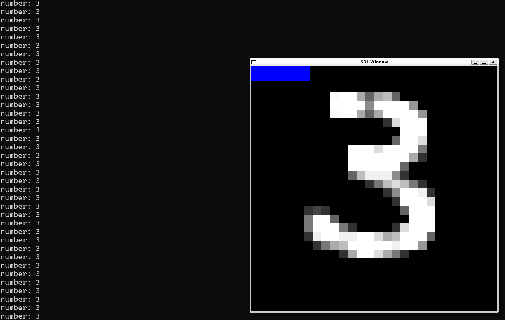

basic mnist implementation in c using matrix operations from cblas

mnist train set from idx 60k images (28x28 greyscale)

> 99% accuracy

implements:

    - batching to further improve performance

    - serialization and deserialization of the final model

    - user interface with realtime drawing-eval and a small clear button on the top left

## Preview

